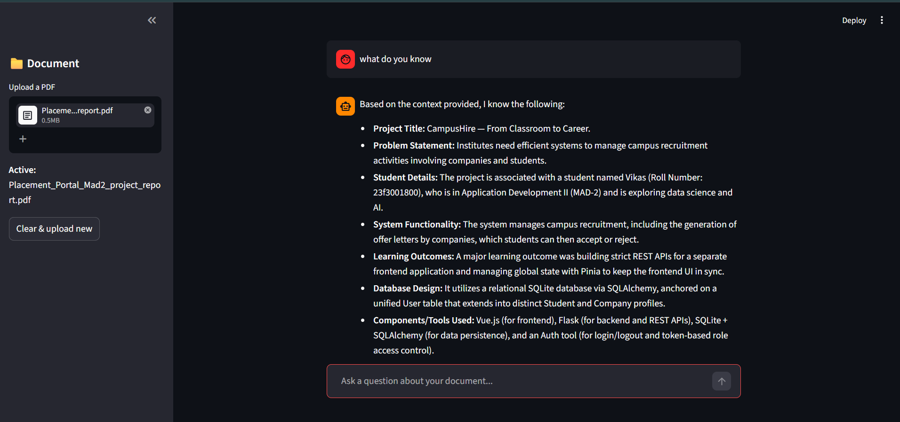

# DocuMind — AI Document Q&A

Ask questions about any PDF and get cited answers powered by RAG.

## How it works
1. PDF is loaded and split into 500-char chunks with 50-char overlap
2. Chunks are embedded using sentence-transformers/all-MiniLM-L6-v2
3. Stored in ChromaDB with MMR retrieval for diverse context
4. Gemini 1.5 Flash generates answers grounded in retrieved chunks
5. Source pages are surfaced alongside every answer
6. Uses streaming,  Users see text appearing almost immediately rather than waiting for the entire response to be generated.

## Stack
LangChain · ChromaDB · HuggingFace Embeddings · Gemini · Streamlit

## For Run locally
pip install -r requirements.txt
streamlit run app.py

## Tested successfully

